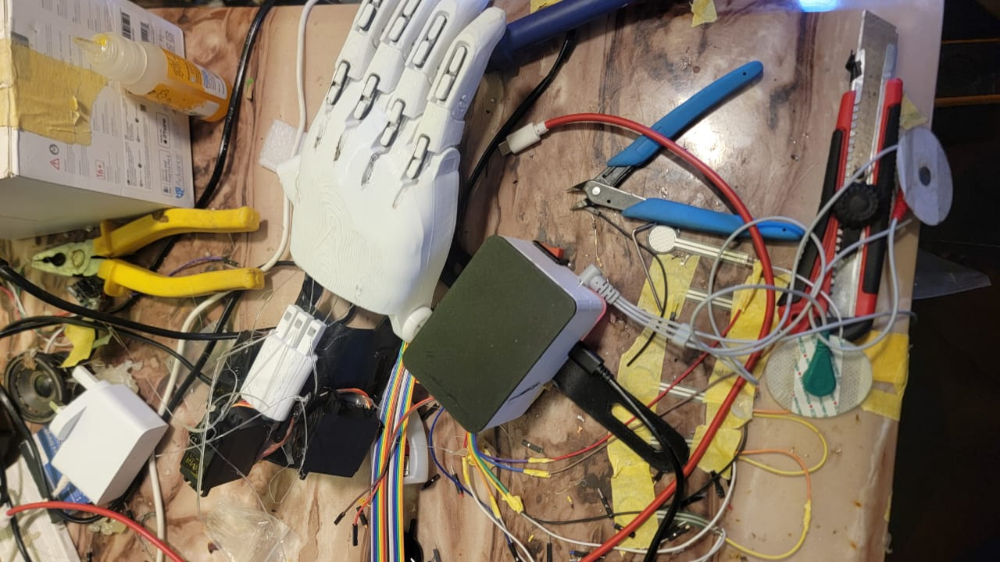
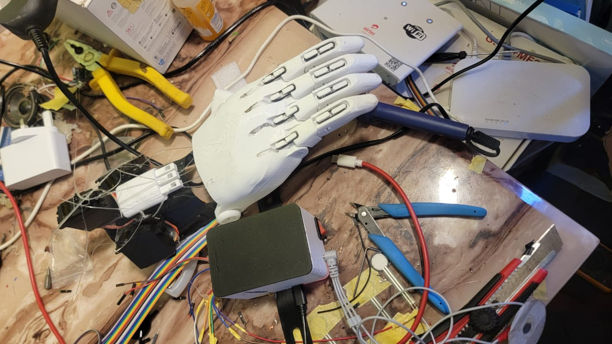
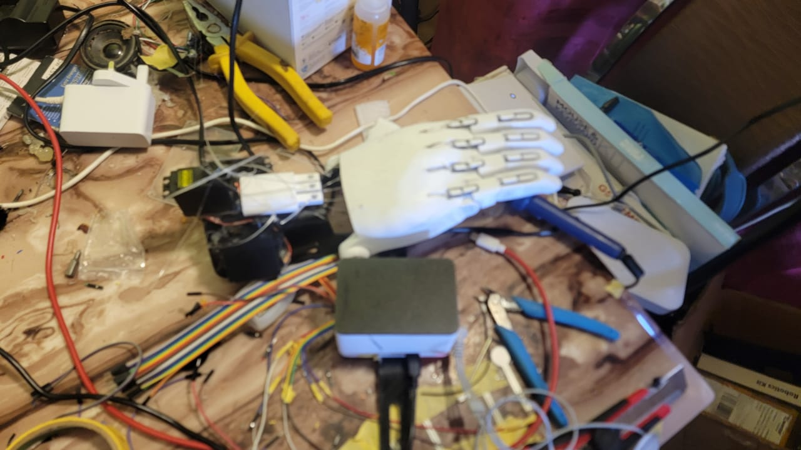
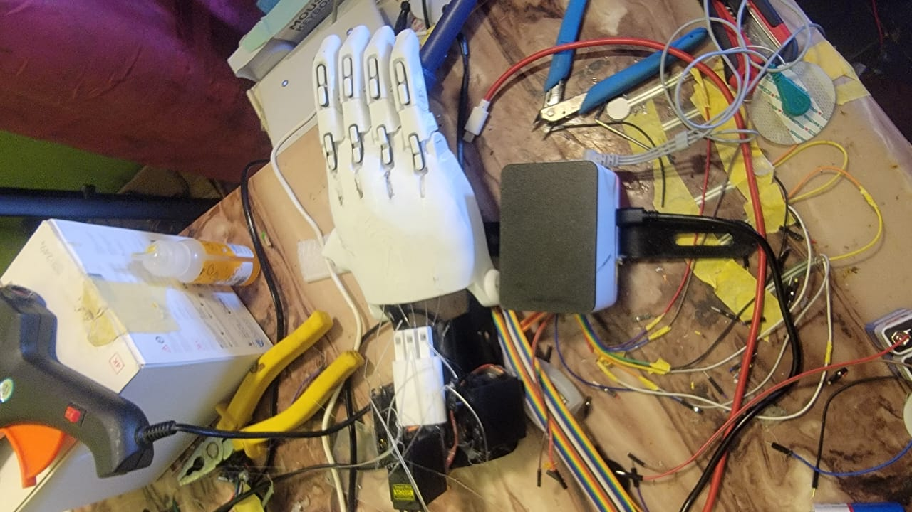
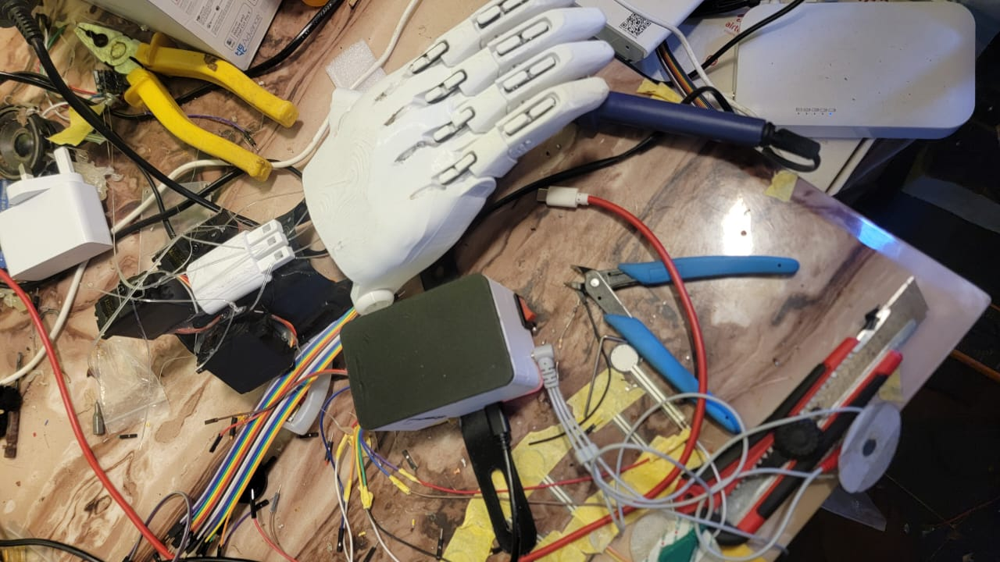
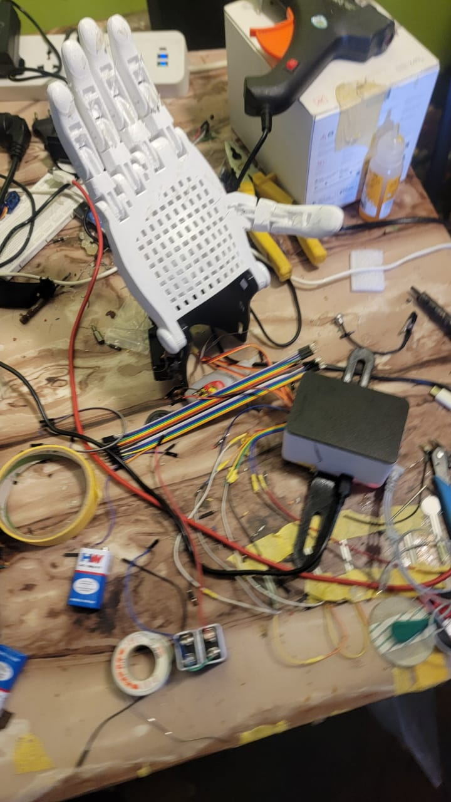
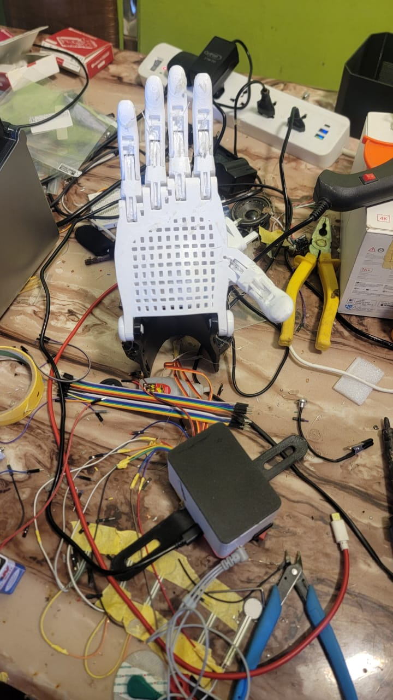

# MEPA Hand Controller

MEPA is a myoelectric prosthetic hand assistive project for Adekunle. This
repository contains the ESP32-S3 firmware, the on-device web page used to
calibrate and operate the hand, the Component Holder CAD files I designed to
mount the controller to the forearm, and the printed hand parts used from the
e-NABLE Phoenix Hand v3 open-source design.

- **Firmware author:** Saka Adetayo Muhammed
- **Web app author:** Saka Adetayo Muhammed
- **Component Holder CAD designer:** Saka Adetayo Muhammed
- **Printed hand design:** e-NABLE Phoenix Hand v3 (see Credits)

## Repository layout

```
EMG_Final.ino         ESP32-S3 firmware
webpage.h             embedded web interface (served from the hand)
secrets.h.example     template for WiFi + AP credentials
.gitignore            keeps secrets.h out of git
cad/                  Component Holder CAD (my own designs)
hand_cad/             Phoenix Hand v3 STLs (right-hand set, CC BY 4.0)
images/               project photos
```

## Setup

1. Copy the credentials template and fill in your own WiFi:
   ```bash
   cp secrets.h.example secrets.h
   ```
   Edit `secrets.h` with your WiFi SSID/password and a password for the
   fallback access point. `secrets.h` is listed in `.gitignore` and must
   never be committed.
2. Open `EMG_Final.ino` in the Arduino IDE with ESP32-S3 board support.
3. Flash the board. On boot the hand joins your WiFi; if the router is not
   found, it starts an access point called `MEPA-Hand`.
4. Browse to the hand's IP (printed over Serial) to open the control page.

## Demo video

[](https://www.youtube.com/watch?v=HJqXraCBs9A)

<https://www.youtube.com/watch?v=HJqXraCBs9A>

## Image gallery

| | | |
|---|---|---|
|  |  |  |
|  |  |  |
|  | | |

## Credits

The printed hand is the **e-NABLE Phoenix Hand v3**, which is not my design.
It was created by **Jason Bryant, John Diamond, Scott Darrow, Andreas Bastian,
Team Unlimbited, e-NABLE France and Jeremy Simon**, and is licensed under
**Creative Commons Attribution 4.0 (CC BY 4.0)**.

Source: <https://www.thingiverse.com/thing:4056253>

The nine right-hand STL files in `hand_cad/` are redistributed from that
project under CC BY 4.0 with attribution to the original designers above.

The firmware (`EMG_Final.ino`), web application (`webpage.h`) and all files
under `cad/` were written and designed by Saka Adetayo Muhammed for his
brother Adekunle.
